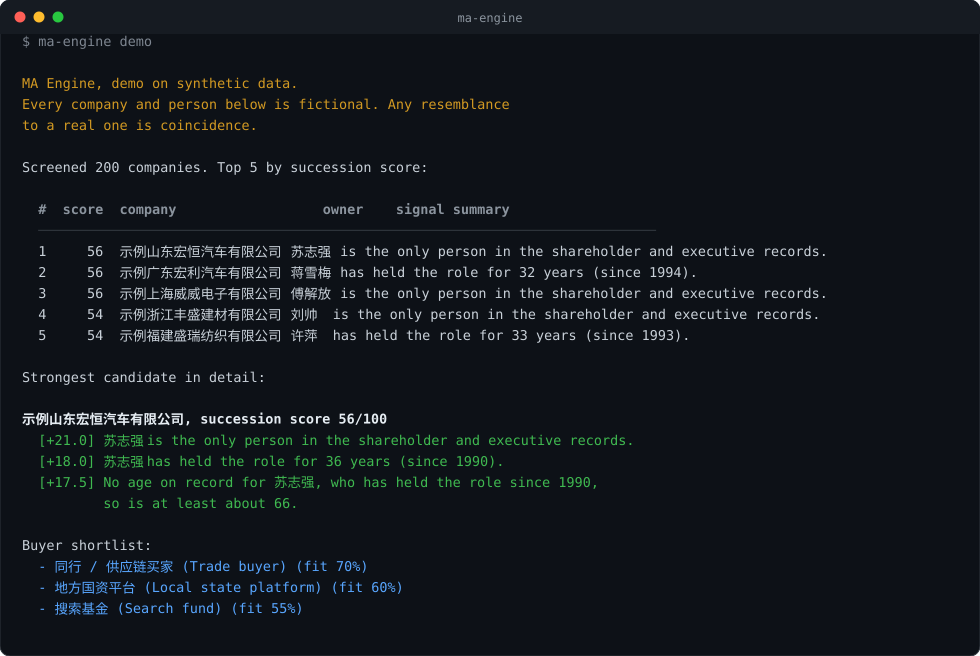

# MA Engine

[](https://github.com/Boldtulip/ma-engine/actions/workflows/tests.yml)
[](LICENSE)

MA Engine is an open-source tool for finding acquisition targets in
China. It takes a list of private companies, works out which owners
are likely to be approaching retirement without a successor, gives
each company a score with the reasons written out, and produces a
short dossier with a buyer shortlist.

The founders who started China's private companies in the 1980s and
1990s are now reaching retirement age at the same time. Estimates put
the number of private companies facing a succession decision in the
next ten years at over three million, and in surveys a large share of
the second generation says it does not want to take over. Japan went
through the same transition about ten years earlier, and there the
hard part turned out to be finding the companies before anyone else
did. This project is that part.

<p align="center">
  
</p>

## Quickstart

```bash
git clone https://github.com/Boldtulip/ma-engine && cd ma-engine
pip install -e .
ma-engine demo
```

The demo scores 200 fictional companies and prints the ranking. It
needs no API key or account.

```
  #  score  company                  owner    signal summary
  1     59  江苏利昌包装有限公司     萧玉珍   萧玉珍 is the only person in the shareholder and executive records.
  2     58  上海威威电子有限公司     傅解放   傅解放 is the only person in the shareholder and executive records.
  ...
```

To see the full dossier for one company:

```bash
ma-engine dossier --name 上海威威
```

The dossier contains the succession analysis, a ranked list of buyer
types with the reasoning for each, notes on deal structure and on the
seller's position, and the points we check before spending more time
on a company. If `ANTHROPIC_API_KEY` is set, Claude writes the
dossier; if not, a template version is produced from the same facts.

## Data sources

The engine reads companies through adapters. All adapters produce the
same records, so the scoring does not care where the data came from.
Four are included:

- **Synthetic demo data.** Bundled with the repository. Every company
  and person in it is invented.
- **A-share disclosures.** `ma-engine score --ashare`. Companies listed
  in China must publish their chairman's age, so for listed companies
  the most important signal is a disclosed fact rather than an
  estimate. This source is free and needs no credentials. Details
  below.
- **Your own CSV.** `ma-engine score --csv yourfile.csv`. The expected
  columns are documented in `adapters/csv_adapter.py`.
- **QCC official API.** `adapters/qcc.py`. This is the path for
  unlisted private companies. It needs your own corporate-verified
  credentials on openapi.qcc.com, or on qcckyc.com from outside
  mainland China.

This repository contains no data about real companies or people. The
A-share adapter produces a table that names living individuals next to
a score, and that table stays on the machine that generated it.

### The A-share adapter

```bash
pip install -e ".[ashare]"
ma-engine score --ashare --limit 200      # a first slice
ma-engine score --ashare                  # the whole market, 20 to 40 minutes
ma-engine export --ashare                 # write a CSV and a ranked watchlist
```

The adapter reads four public sources: the list of listed companies,
each chairman's disclosed age and appointment date, the actual
controller (实际控制人), and the weekly equity-pledge file. It keeps
only privately controlled companies. Whether a company is private or
state-owned is not published as a field anywhere, so it is inferred
from the controller's name, which is how the academic databases do it
too.

One thing to know if you run this from outside mainland China. The
endpoints are not blocked, but opening a new connection to them from
abroad takes about forty seconds, while a connection that is already
open answers in a fraction of a second, so the adapter keeps one
persistent session per worker thread. This is also why common Python
wrappers for the same endpoints appear to hang from abroad: they open
a new connection for every call.

## How the scoring works

Chinese company registries publish shareholder names, registered
capital and change records, but not ages. The engine uses four signals
that can all be computed from public data:

| Signal | What it reads | Example of the reason it writes |
|---|---|---|
| Owner age | The disclosed age where there is one. Otherwise the owner's given name: Chinese given names follow strong generational fashions, so 建国 points to a birth around 1950 and 子轩 to around 2005. | "王建国 is estimated around 71 years old (given name '建国' peaks in the 1950s)." |
| Owner tenure | Change records for the legal representative, which are public. | "王建国 has held the role for 34 years (since 1992)." |
| Visible heir | Whether a younger person with the owner's surname appears among the shareholders or executives. | "None of the 3 other people on record share the owner's surname 王." |
| Sell pressure | Pledged equity (股权出质, public) and published litigation. | "89% of the controlling stake is pledged." |

Each signal produces a number between 0 and 1 and one sentence like
the examples above. The score is a weighted sum, and the sentences are
kept, so every score can be read back as a short list of things to
check. A signal only moves the score as far as its confidence allows:
an age estimated from a name counts for about half as much as a
disclosed age, and missing data lowers a score rather than raising it.

### The age curve

Older does not simply mean more likely to sell. An owner who is still
running the company at 82 has shown over many years that he does not
intend to sell, and by that age the succession has usually been
settled inside the family or the company one way or another. The owner
who is most likely to actually sell is in his sixties: past the
statutory retirement age, still in good health, with a business that
is still easy to hand over.

So the age signal rises through the fifties, peaks between about 63
and 72, and declines after that without going to zero. The anchor
points are in `signals/age.py`. They are a judgment, not a
measurement, and the way to improve them is to compare them against a
record of which companies actually sold. The same applies to the
weights in `scoring/weights.yaml`. That record is built up deal by
deal, and it is not part of this repository.

The bundled table of given names and birth cohorts is a small
demonstration subset. For serious use, replace it with the full
ChineseNames database (Bao et al., birth-year distributions covering
1.2 billion people, 1930-2008).

## The knowledge base

The `knowledge/` folder holds what the engine knows about M&A in China,
as YAML files that the language model reads and that anyone can open
and check. The matching module and the dossier use them, and nothing
is in a prompt that is not also in these files.

- `buyers_china.yaml` describes who buys private companies in China
  (listed companies, industrial M&A funds, local state platforms,
  search funds, trade buyers, foreign strategics), what each of them
  wants, and what constrains them.
- `fit_criteria.yaml` lists what makes a company a good target and the
  problems that end deals in due diligence.
- `deal_structures.yaml` covers the deal structures that suit a
  succession sale.
- `origination_playbook.yaml` covers how we source deals: how buyer
  lists are built and ranked, what tells us a seller is serious,
  published outreach benchmarks, and the standard formats for a teaser
  and a target profile.
- `valuation_heuristics.yaml` gives multiples for small and mid-sized
  companies by size, and typical terms for rollover equity, seller
  notes and earnouts.
- `seller_economics.yaml` covers what the founder actually receives:
  the 20% individual income tax on share transfers, when the tax
  authority sets the price itself, who withholds the tax, and the fact
  that a performance undertaking given by the founder personally is
  enforceable while one given by the company often is not.

Every number in these files carries a confidence tag (well-sourced,
medium, or heuristic) so that the reader and the model both know how
much weight to give it.

To use your own knowledge base instead of the bundled one, set
`MA_ENGINE_KNOWLEDGE_DIR` to your folder.

## Rules the project follows

1. **No scraping.** Chinese courts have convicted people for scraping
   registry and platform data from behind anti-bot measures, and have
   rejected the argument that the data was already public. The only
   route to unlisted-company data that this project supports is the
   official API, with your own credentials.
2. **Estimates are marked as estimates.** An age inferred from a name
   is a probability, and every output says so.
3. **No personal data is distributed.** The repository ships synthetic
   data only.
4. **Scores are not claims about people.** A score says where to look
   first. It does not say that anyone intends to sell, retire, or
   anything else.

## Roadmap

- [ ] Resolve controllers held through intermediate holding companies.
      Today these are classed as "other legal person" instead of being
      traced up the chain.
- [ ] Integrate the full ChineseNames cohort database.
- [ ] Reference implementation of the QCC adapter.
- [ ] Match against a real universe of acquirers, not only buyer types.

## License

MIT.
