# MA Engine

[](https://github.com/Boldtulip/ma-engine/actions/workflows/tests.yml)
[](LICENSE)

**An open-source M&A origination engine for China.** It screens private
companies, estimates which owners are approaching succession without a
successor, scores every company with checkable reasons, and drafts the
first deal documents a banker would write.

China's first generation of private entrepreneurs, the founders of the
1980s and 1990s, is reaching retirement age at the same time. Research
groups estimate that **over 3 million private companies** will face a
succession decision within ten years, and in surveys a large share of
the second generation says it does not want to take over. Japan went
through the same transition ten years earlier, and deal *sourcing*
(finding the companies before anyone else) turned out to be the
bottleneck of the entire market. This project is the sourcing layer,
open-sourced.

<p align="center">
  
</p>

## What it runs on

The engine is source agnostic. It ships with synthetic demo data so it
runs immediately, and it reads real companies through three other
adapters.

The one that needs no credentials is the A-share adapter. Companies
listed in China must publish their chairman's exact age in their own
filings, which makes listed companies the only population where the
most important signal is a disclosed fact rather than an estimate.
Point the engine at that population and it screens the whole market in
about half an hour:

```bash
ma-engine score --ashare            # builds the ranked table locally
ma-engine export --ashare           # writes a CSV and a watchlist
```

**This repository publishes no data about real companies or people.**
That output names living individuals next to an algorithmic score, so
it belongs on your machine, not in a public repository. Everything
committed here is synthetic.

Listed companies are in any case the visible tip of the problem. The
same signals apply to the roughly 50 million private companies that
publish far less, which is what the other adapters are for.

```mermaid
flowchart LR
    subgraph SOURCES["1 · Where companies come from"]
        direction TB
        A1["Bundled demo data<br/><i>runs with no setup</i>"]
        A2["A-share disclosures<br/><i>free, real ages</i>"]
        A3["Your CSV"]
        A4["QCC API<br/><i>your credentials</i>"]
    end

    subgraph SIGNALS["2 · What the engine reads"]
        direction TB
        S1["Owner age<br/><i>disclosed, or from the given name</i>"]
        S2["Owner tenure<br/><i>how long in the chair</i>"]
        S3["Visible heir?<br/><i>younger relative on record</i>"]
        S4["Sell pressure<br/><i>pledges, litigation</i>"]
    end

    SCORE["3 · Succession score 0-100<br/><b>every point traced to a sentence</b>"]

    subgraph KNOW["Knowledge base · YAML you can read and edit"]
        direction TB
        K1["Who buys in China"]
        K2["What makes a good target"]
        K3["Deal shapes and seller economics"]
    end

    subgraph OUT["4 · What you get"]
        direction TB
        O1["Ranked target list"]
        O2["Buyer shortlist<br/><i>with written reasons</i>"]
        O3["Deal dossier"]
    end

    SOURCES --> SIGNALS --> SCORE --> OUT
    KNOW -.-> OUT

    style SCORE fill:#1f6feb,stroke:#1f6feb,color:#ffffff
    style KNOW fill:#f6f8fa,stroke:#8b949e,stroke-dasharray: 4 3
```



The engine is open. **The fuel is not.** Credentials, calibrated
weights, and your record of which companies actually sold stay on your
side, which is why cloning this repository gives you the machine, not
the advantage.

## Quickstart

```bash
git clone <this repo> && cd ma-engine
pip install -e .
ma-engine demo
```

`ma-engine demo` screens 200 bundled synthetic companies and prints the
ranked pipeline in seconds. No API keys, no accounts, no setup.

```
  #  score  company                    owner    signal summary
  1     68  山东凯丰五金有限公司        宋国庆   宋国庆 is the only person in the shareholder and executive records.
  2     60  山东华丰食品有限公司        刘桂英   刘桂英 is the only person in the shareholder and executive records.
  ...
```

Then write the full dossier for any company:

```bash
ma-engine dossier --name 山东凯丰
```

The dossier contains the succession analysis, a ranked buyer shortlist
with a written rationale per buyer type, a suggested deal shape, and
the open questions a banker would verify first. With an Anthropic API
key set (`ANTHROPIC_API_KEY`), Claude writes the full analyst version;
without one, a deterministic template version is produced.

## How the scoring works

Chinese registries publish shareholder names, capital, and change
records, but **not ages**. The engine works around that gap with
signals that are all computable from public data:

| Signal | What it reads | Example reason it produces |
|---|---|---|
| Owner age | Disclosed age where it exists; otherwise the owner's **given name**. Chinese given names follow strong generational fashions: 建国 points to ~1950, 子轩 to ~2005. | "王建国 is estimated around 71 years old (given name '建国' peaks in the 1950s)." |
| | *The age curve rises through the fifties, peaks between about 63 and 72, and then **falls**. See below.* | |
| Owner tenure | Legal-representative change records (变更记录), which are public. | "王建国 has been legal representative for 34 years." |
| Visible heir | Whether a younger person sharing the owner's surname appears among shareholders or executives. | "None of the 3 other people on record share the owner's surname 王." |
| Sell pressure | Equity pledges (股权出质, public) and published litigation. | "89% of the controlling stake is pledged." |

Every score decomposes into sentences like these. A signal only moves
the score as far as its confidence allows: an age estimated from a name
counts for about half of a disclosed age, and missing data pulls a
score down, never up.

### Why the age curve falls after about 72

The obvious way to score age is "older means more likely to sell."
That is wrong, and it produces a useless target list.

An owner still in the chair at 82 has spent twenty years demonstrating
that he does not intend to sell. By that age control has usually been
arranged already, inside the family or the company. He is the least
persuadable seller on the list, not the most. Meanwhile the owner in
his sixties is at the actual decision point: past the statutory
retirement age, still in good health, running a business that is still
straightforward to sell.

So the curve peaks between roughly 63 and 72 and declines after that,
without ever going to zero. In the live data this is the difference
between a top-20 list led by owners of 80, 82 and 87 (the rarest and
least reachable cases, under 1% of the population) and one led by
owners of 62 to 70, which is where the deals are.

The anchor points are judgment, not measurement. They are in
`signals/age.py`, they are meant to be argued with, and the right way
to settle the argument is to calibrate them against your own record of
which companies actually sold.

The weights in `scoring/weights.yaml` are **illustrative defaults**.
Calibrating them requires outcome data on which companies actually
sold, and that data is what a practitioner accumulates over time. It
is not in this repository.

The bundled name-cohort table is a small demonstration subset. For
production use, plug in the full ChineseNames database (Bao et al.,
birth-year distributions for 1.2 billion people, 1930–2008).

## The knowledge base

The `knowledge/` folder encodes how a China M&A professional thinks,
as plain data files the LLM reads and any person can audit:

- **`buyers_china.yaml`** covers who buys private SMEs in China: listed
  companies, industrial M&A funds, local state platforms, search
  funds, trade buyers, foreign strategics, each with motives,
  preferences, and constraints.
- **`fit_criteria.yaml`** covers what makes a target good, and the red
  flags that kill deals in diligence.
- **`deal_structures.yaml`** covers the deal shapes that fit succession
  sales, from majority-with-transition to fund SPV structures.
- **`origination_playbook.yaml`** covers how professional sourcing works:
  buyer-list tiering, seller-intent signals, documented outreach
  funnel benchmarks, and the canonical teaser and target-profile
  formats.
- **`valuation_heuristics.yaml`** covers SME multiples by size, the size
  discount, key-man discounts, and standard structure parameters
  (rollover, seller notes, earnouts).
- **`seller_economics.yaml`** covers what the founder actually walks away
  with: the 20% individual income tax on share transfers, when the
  authorities assess the price themselves, who withholds, and the
  asymmetry that decides post-closing risk: a performance
  undertaking given by the founder personally is fully enforceable,
  while one given by the company often is not.

Every number in these files carries a confidence tag of well-sourced,
medium, or heuristic, so the model and the reader both know how much
weight it deserves.

To run the engine against your own knowledge base instead of the
bundled one, point `MA_ENGINE_KNOWLEDGE_DIR` at your folder:

```bash
export MA_ENGINE_KNOWLEDGE_DIR=/path/to/my-knowledge
```

Nothing is hidden in a prompt that is not also in these files. Extend
them like data, not like code.

## Bring your own data

The engine is open. The fuel is yours:

- **Bundled synthetic data.** Works instantly, every name fictional.
- **A-share disclosures**, `ma-engine score --ashare`. Listed companies
  must publish their chairman's exact age, so this is the one segment
  where the most important signal is a fact rather than an estimate.
  Free, public, no credentials. See below.
- **Your CSV**, `ma-engine score --csv yourfile.csv` with your own
  research.
- **QCC official API** (`adapters/qcc.py`), the private-company path.
  Requires your own corporate-verified credentials on openapi.qcc.com
  (or qcckyc.com outside mainland China).

### The A-share adapter

```bash
pip install -e ".[ashare]"
ma-engine score --ashare --limit 200        # try it on a slice first
ma-engine score --ashare                    # the whole market, ~20-40 min
```

It reads four public sources: the listed-company universe, the
chairman's disclosed age and appointment date, the actual controller
(实际控制人), and the weekly equity-pledge file. It then keeps only the
privately controlled companies. Ownership type is not published as a
field anywhere, so it is inferred from the controller's name, which is
the convention the academic databases use.

Output from the bundled demo (synthetic companies):

```
MA Engine, demo on synthetic data.
Every company and person below is fictional.

  #  score  company                owner    signal summary
  1     59  浙江昌泰建材有限公司   丁凤英   estimated around 71 ('凤英' peaks in the 1950s).
  2     59  江苏利昌包装有限公司   萧玉珍   only person in the shareholder and executive records.
  3     58  上海威威电子有限公司   傅解放   only person in the shareholder and executive records.
```

Against real filings the same command prints disclosed ages instead of
estimates, and the reason column reads, for example, *"… is 64 years
old (disclosed)"*.

**One implementation note worth knowing if you work from outside
China.** These endpoints are not geo-blocked, but opening a new TLS
connection to them from abroad costs around forty seconds, while
reusing an open one costs a fraction of a second. The adapter keeps
one persistent session per worker thread. This is also why the obvious
library wrappers appear to hang from abroad: they open a fresh
connection for every call.

## Legal and ethical boundaries

This project draws a hard line, on purpose:

1. **No scraping.** Chinese courts have issued criminal convictions
   for scraping registry and platform data behind anti-bot measures,
   and rejected "it was already public" as a defense. The only
   private-company data path this project supports is the official,
   licensed API, with your own credentials.
2. **Estimates are labeled as estimates.** An age inferred from a name
   is a probability, not a fact, and every output says so.
3. **No personal data is distributed.** The repository ships synthetic
   demo data only. Scored tables about real, named individuals are
   generated on your machine and stay there.
4. **Scores are screening aids, not claims about people.** The engine
   ranks where a professional should *look first*. It never asserts
   that a named individual intends to sell, retire, or anything else.

## Roadmap

- [x] A-share adapter reading live public disclosures
- [x] Full-market run over every listed company (reproducible locally)
- [ ] Resolve controllers held through intermediate holding companies
      (today those fall into "other legal person" rather than being
      traced up the chain)
- [ ] Full ChineseNames cohort integration
- [ ] QCC adapter reference implementation
- [ ] Buyer-side matching against a real acquirer universe

## License

MIT.
